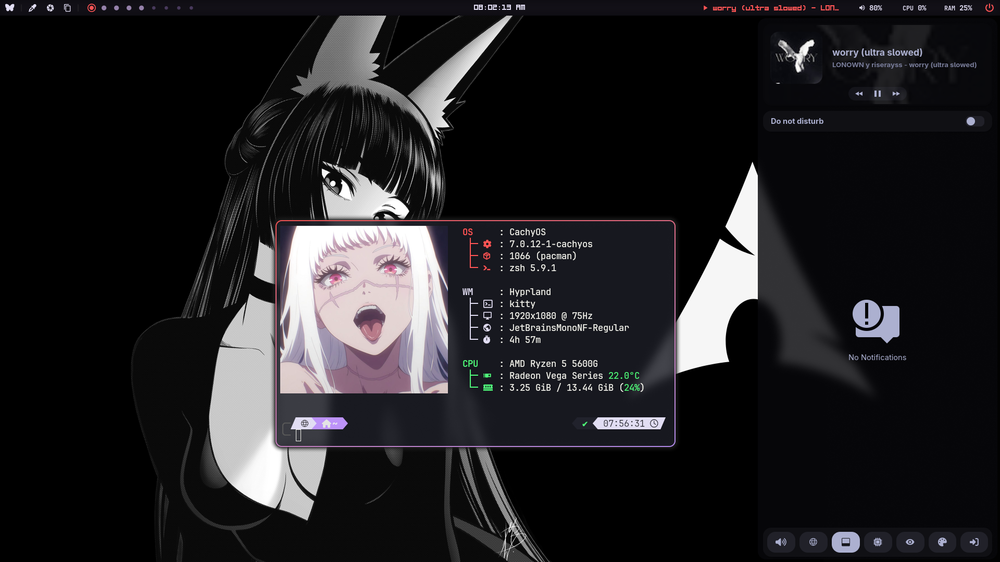
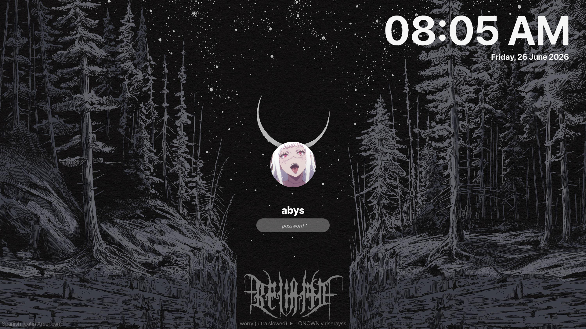

# dotfiles

> CachyOS · Hyprland · Dracula

My personal dotfiles for a Wayland-native desktop built around Hyprland, themed with a customized Dracula palette. The Hyprland config is written entirely in **Lua** using the new native Lua API.

---



---

## Stack

| Role | Tool |
|---|---|
| OS | [CachyOS](https://cachyos.org/) |
| WM / Compositor | [Hyprland](https://hyprland.org/) |
| Bar | [Waybar](https://github.com/Alexays/Waybar) + [EWW](https://github.com/elkowar/eww) |
| Launcher | [Rofi](https://github.com/lbonn/rofi) (Wayland fork) |
| Notification Center | [SwayNC](https://github.com/ErikReider/SwayNotificationCenter) |
| Terminal | [Kitty](https://github.com/kovidgoyal/kitty) |
| Shell | Zsh + [Oh My Zsh](https://ohmyz.sh/) + [Powerlevel10k](https://github.com/romkatv/powerlevel10k) |
| Editor | [Neovim](https://neovim.io/) (LazyVim) · [VSCodium](https://vscodium.com/) |
| File Manager | [Thunar](https://docs.xfce.org/xfce/thunar/start) |
| Lockscreen | [hyprlock](https://github.com/hyprwm/hyprlock) |
| Idle Daemon | [hypridle](https://github.com/hyprwm/hypridle) |
| Wallpaper | [hyprpaper](https://github.com/hyprwm/hyprpaper) |
| Audio Visualizer | [cava](https://github.com/karlstav/cava) |
| System Monitor | [btop++](https://github.com/aristocratos/btop) |
| Fetch | [fastfetch](https://github.com/fastfetch-cli/fastfetch) |
| Color Picker | [hyprpicker](https://github.com/hyprwm/hyprpicker) |
| Cursor | [hyprcursor](https://github.com/hyprwm/hyprcursor) |
| Screenshots | [grim](https://sr.ht/~emersion/grim/) + [slurp](https://github.com/emersion/slurp) |
| Clipboard | [wl-clipboard](https://github.com/bugaevc/wl-clipboard) + [cliphist](https://github.com/sentriz/cliphist) |
| GTK Theme | Dracula (custom) |
| Fonts | JetBrainsMono Nerd Font · SF Pro Display · Inter |

---

## Screenshots

| Desktop | Lockscreen |
|---|---|
|  |  |

---

## Structure

Dotfiles are managed with [GNU Stow](https://www.gnu.org/software/stow/). Each top-level directory is a stow package that mirrors `$HOME`.

```
~/.dotfiles/
├── btop/           → ~/.config/btop/
├── cava/           → ~/.config/cava/
├── eww/            → ~/.config/eww/
├── fastfetch/      → ~/.config/fastfetch/
├── gtk-3.0/        → ~/.config/gtk-3.0/
├── gtk-4.0/        → ~/.config/gtk-4.0/
├── hypr/           → ~/.config/hypr/
├── kitty/          → ~/.config/kitty/
├── Kvantum/        → ~/.config/Kvantum/
├── nvim/           → ~/.config/nvim/
├── oh-my-posh/     → ~/.config/oh-my-posh/  (archived, not in use)
├── p10k/           → ~/.p10k.zsh
├── rofi/           → ~/.config/rofi/
├── swaync/         → ~/.config/swaync/
├── waybar/         → ~/.config/waybar/
└── zsh/            → ~/.zshrc + ~/.config/zsh/
```

### Hyprland config

The Hyprland configuration uses the native Lua API and is split into modules under `hypr/.config/hypr/configuration/`:

```
configuration/
├── alias.lua                 # App aliases (terminal, browser, file manager, menu)
├── environment.lua           # Environment variables
├── input.lua                 # Keyboard, mouse, device settings
├── keybindings.lua           # All keybindings
├── look_and_feel.lua         # Gaps, borders, animations, blur
├── misc.lua                  # Miscellaneous settings
├── monitors.lua              # Monitor configuration (hardware-specific)
├── window_and_layer_rules.lua
└── windows_and_workspaces.lua
```

---

## Installation

### Dependencies

Install the core packages on CachyOS / Arch:

```bash
sudo pacman -S hyprland hyprlock hypridle hyprpaper hyprpicker \
               waybar kitty zsh rofi-wayland \
               swaync wl-clipboard cliphist \
               grim slurp fastfetch btop cava \
               thunar nwg-look kvantum qt5ct qt6ct \
               playerctl pavucontrol nm-connection-editor \
               gnu-stow hyprsunset
```

```bash
# From AUR
paru -S eww-wayland hyprcursor
```

### Setup

```bash
# Clone the repo
git clone git@github.com:abys-summon/dotfiles.git ~/.dotfiles
cd ~/.dotfiles

# Configure sensitive/hardware-specific variables
cp zsh/.config/zsh/export.example.zsh zsh/.config/zsh/export.zsh
# Edit export.zsh and fill in your LAT, LON and GPU_BUSY_PATH

# Remove or back up existing configs to avoid stow conflicts
# Example:
mv ~/.config/hypr ~/.config/hypr.bak

# Symlink everything
stow btop cava eww fastfetch gtk-3.0 gtk-4.0 hypr kitty \
     Kvantum nvim p10k rofi swaync waybar zsh
```

### Hardware-specific files

These files contain values specific to the machine and must be adjusted manually:

| File | What to change |
|---|---|
| `hypr/.config/hypr/configuration/monitors.lua` | Output name, resolution, refresh rate |
| `hypr/.config/hypr/configuration/input.lua` | Mouse device name and sensitivity |
| `zsh/.config/zsh/export.zsh` | `LAT`, `LON`, `GPU_BUSY_PATH` |
| `waybar/.config/waybar/config.jsonc` | GPU sysfs path in `custom/gpu` |
| `fastfetch/.config/fastfetch/config.jsonc` | GPU display name |

### Wallpapers

Wallpapers are not included in the repo. The following paths are referenced in the config:

```
~/Pictures/wallpapers/arch-tan.png   # hyprpaper
~/Pictures/wallpapers/hyprlock.jpg   # hyprlock background
~/.config/pfp.png                    # hyprlock profile picture
```

---

## Keybindings

`SUPER` is the main modifier.

### Apps

| Keybind | Action |
|---|---|
| `SUPER + T` | Terminal (kitty) |
| `SUPER + B` | Browser (firefox) |
| `SUPER + F` | File manager (thunar) |
| `SUPER + R` | App launcher (rofi) |
| `SUPER + N` | Notification center (swaync) |
| `SUPER + .` | Emoji picker |

### Windows

| Keybind | Action |
|---|---|
| `SUPER + X` | Close window |
| `SUPER + V` | Toggle float |
| `SUPER + P` | Toggle pseudo-tile |
| `SUPER + I` | Toggle split (dwindle) |
| `SUPER + arrows / H J K L` | Move focus |
| `SUPER + ALT + arrows / H J K L` | Swap windows |
| `SUPER + LMB drag` | Move floating window |
| `SUPER + RMB drag` | Resize window |

### Workspaces

| Keybind | Action |
|---|---|
| `SUPER + 1-9` | Switch to workspace |
| `SUPER + SHIFT + 1-9` | Move window to workspace |
| `SUPER + S` | Toggle scratchpad |
| `SUPER + SHIFT + S` | Move window to scratchpad |
| `SUPER + scroll` | Cycle workspaces |

### System

| Keybind | Action |
|---|---|
| `SUPER + SHIFT + W` | Toggle waybar |
| `SUPER + DELETE` | Exit Hyprland |
| `XF86Audio*` | Volume / mute controls |
| `XF86MonBrightness*` | Brightness controls |
| `XF86Audio Next/Prev/Play/Pause` | Media controls (playerctl) |

---

## Waybar Controls

The status bar includes a buttons with utilities:

| Button | Action |
|---|---|
| 🦋 | rofi (launcher) |
| 🖌️ | hyprpicker |
| 📸 | screenshot (grim + slurp) |
| 📋 | rofi (cliphist list) |
| 🚫 | rofi (power menu) |

---

## SwayNC Controls

The notification center includes a buttons grid with system utilities:

| Button | Action |
|---|---|
| 🔊 | pavucontrol (audio) |
| 🌐 | nm-connection-editor (network) |
| ➖ | Toggle waybar |
| 📊 | btop in floating kitty (1280×720) |
| 👁️ | Toggle night light (hyprsunset 3500K) |
| 🎨 | nwg-look (GTK theme) |
| ↪️ | rofi (power menu) |

---

## Notes

- `export.zsh` is gitignored — copy from `export.example.zsh` and fill in your values.
- `gtk-4.0` symlinks point to `~/.themes/Dracula-alt-style/` — install the theme before stowing.
- `oh-my-posh` config is archived, not actively used.
- `btop` has `save_config_on_exit = false` to avoid noisy git diffs.
- The `p10k` instant prompt requires `~/.cache/p10k-instant-prompt-*.zsh` to exist on first run.
